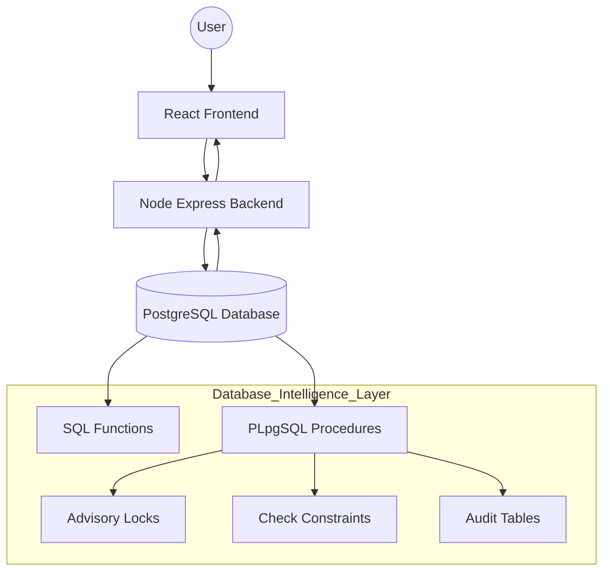

# 🌍 Smart Tourism Recommendation & Booking Platform

> **A database-centric, full-stack tourism management system engineered to deliver budget-aware recommendations, transaction-safe bookings, and integrity-enforced review management using advanced PostgreSQL features.**

---

## 📖 Table of Contents
1. [Project Overview](#-project-overview)
2. [Key Design Philosophy](#-key-design-philosophy)
3. [System Architecture](#-system-architecture)
4. [Tech Stack](#-tech-stack)
5. [Database Engineering Highlights](#-database-engineering-highlights)
6. [Core Functional Modules](#-core-functional-modules)
7. [API & Frontend Specifications](#-api--frontend-specifications)
8. [Installation & Setup](#-how-to-run-the-project)
9. [Academic & Technical Value](#-academic--technical-value)
10. [Future Roadmap](#-future-roadmap)

---

## 📌 Project Overview

The **Smart Tourism Recommendation & Booking Platform** is a **DBMS-first web application** that emphasizes database-driven intelligence over application-layer logic.

Unlike conventional systems where the backend server performs most validations and computations, this platform embeds critical business rules—such as **budget enforcement, recommendation filtering, transaction safety, and review validation**—directly within the **PostgreSQL database** using SQL and PL/pgSQL.

### Key Capabilities
- **Exploration:** Browse cities, hotels, food places, attractions, and transport options.
- **Smart Recommendations:** Budget-aware and rating-based filtering at the database level.
- **Secure Bookings:** Atomic booking transactions with automatic cost computation.
- **Review System:** Unified and constraint-safe reviews across multiple entity types.

---

## 🧠 Key Design Philosophy

> **“Let the database enforce correctness.”**

This project follows a **Thick Database / Thin Application** architecture:

1. **Business Logic in PostgreSQL**  
   Core rules are implemented using stored functions, procedures, and constraints.

2. **Strong Data Integrity**  
   `CHECK` constraints and typed schemas prevent invalid data states.

3. **Concurrency Control**  
   Advisory locks prevent race conditions during critical operations like bookings.

4. **Transactional Atomicity**  
   Multi-step operations either fully succeed or fully rollback, ensuring consistency.

---

## 🏗️ System Architecture

The backend acts as a lightweight orchestration layer, while PostgreSQL serves as the core intelligence layer responsible for enforcing business rules and data integrity.

