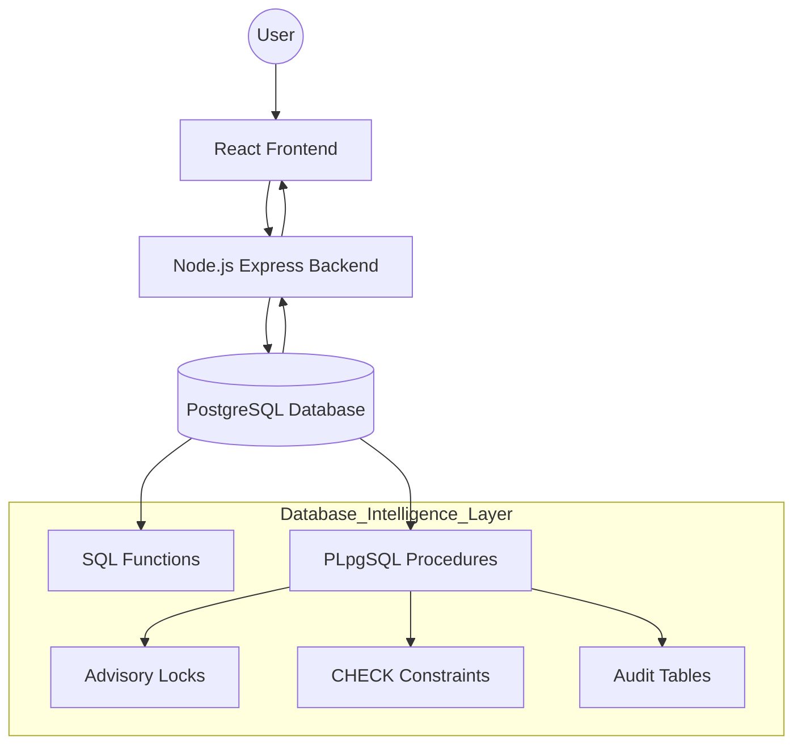

Here is the polished, professional, and corrected version of your `README.md`. I have improved the formatting, added necessary setup steps (like database creation and environment variables), and fixed the diagram syntax.

You can copy and paste the code block below directly into your file.

```markdown
# 🌍 Smart Tourism Recommendation & Booking Platform

> **A database-centric smart tourism platform designed to deliver budget-aware travel recommendations, secure bookings, and integrity-enforced review management using advanced PostgreSQL database programming integrated with a modern full-stack web application.**

---

## 📖 Table of Contents
1. [📌 Project Overview](#-project-overview)
2. [🧠 Key Design Philosophy](#-key-design-philosophy)
3. [🏗️ System Architecture](#-system-architecture)
4. [🛠️ Tech Stack](#-tech-stack)
5. [🗄️ Database Design Highlights](#-database-design-highlights)
6. [🔑 Core Database Features](#-core-database-features)
7. [🔄 Transaction Safety & Concurrency](#-transaction-safety--concurrency)
8. [🌐 API Design](#-api-design)
9. [🖥️ Frontend Features](#-frontend-features)
10. [🧪 Error Handling & Validation](#-error-handling--validation)
11. [▶️ How to Run the Project](#-how-to-run-the-project)
12. [📚 Academic Value (DBMS Focus)](#-academic-value-dbms-focus)
13. [🚀 Future Enhancements](#-future-enhancements)
14. [🏁 Conclusion](#-conclusion)

---

## 📌 Project Overview

The **Smart Tourism Recommendation & Booking Platform** is a **DBMS-first full-stack web application** that prioritizes **database-driven intelligence** over application-layer logic.

Unlike conventional systems where business rules are enforced mainly in backend code, this platform embeds **core logic directly into PostgreSQL** using:

- **SQL Functions**
- **PL/pgSQL Stored Procedures**
- **CHECK Constraints**
- **Transactions**
- **Advisory Locks**
- **JSONB Processing**

### 🎯 What the System Enables
Users can:
- Discover **cities, hotels, food places, attractions, and transport**.
- Receive **budget-aware and rating-based recommendations**.
- Book hotels and transport with **automatic cost computation**.
- Submit and manage reviews in a **constraint-safe, validated system**.

---

## 🧠 Key Design Philosophy

> **“Let the database do the heavy lifting.”**

This project follows a **Thick Database / Thin Application** architecture.

### Core Principles
- 💡 **Business rules live in PostgreSQL**
- 🧹 **Application layer remains thin and clean**
- 🔐 **Data integrity is guaranteed**
- 🔄 **All critical operations are transaction-safe**
- ⚙️ **Concurrency is handled at the database level**

Even under concurrent requests, the database remains the **single source of truth**.

---

## 🏗️ System Architecture

The backend acts as a lightweight orchestration layer, while **PostgreSQL serves as the core intelligence layer**, enforcing business rules and ensuring data integrity.



---

## 🛠️ Tech Stack

### Backend

* **Node.js**
* **Express.js**
* **PostgreSQL**
* **PL/pgSQL** (Stored Procedures & Functions)

### Frontend

* **React** (Vite)
* **Tailwind CSS**
* **Fetch API**

---

## 🗄️ Database Design Highlights

### ✔ Advanced PostgreSQL Usage

| Feature | Usage |
| --- | --- |
| **SQL Functions** | For fetching recommendations and calculating totals. |
| **PL/pgSQL Procedures** | For handling complex transactional workflows (bookings). |
| **CHECK Constraints** | To enforce strictly valid entity types and status codes. |
| **Advisory Locks** | To prevent race conditions during concurrent bookings. |
| **Audit Logging** | Triggers that track booking history and changes. |
| **JSONB Processing** | Efficient batch review insertion and data storage. |

This ensures data correctness even if the application layer fails.

---

## 🔑 Core Database Features

### 🏨 Hotel & Recommendation Functions

* Fetch hotels by city.
* Filter hotels based on user budget.
* Rank hotels by rating and price.
* Retrieve top attractions and food places.

### 💰 Budget-Aware Booking System

* **Automatic total cost computation** (hotel + transport).
* **Budget validation** before booking.
* **Atomic booking creation** using transactions.
* **Optional wallet deduction** logic.
* **Booking cancellation** with refund support.

### ⭐ Review Management System

Reviews are supported for:

1. Hotels
2. Food places
3. Attractions
4. Transport

**Key characteristics:**

* Strict entity validation via `CHECK` constraints.
* Batch review insertion using `JSONB`.
* User-specific review tracking.
* Entity-specific review retrieval.

---

## 🔄 Transaction Safety & Concurrency

All booking and review operations run inside transactions.

### Guarantees

* ❌ **Partial writes are impossible**
* 🔐 **Budget cannot go negative**
* 🔄 **Rollbacks occur automatically on failure**

### Concurrency Control

Concurrent operations are handled using:
`pg_advisory_xact_lock(user_id)`

This prevents race conditions during:

* Bookings
* Budget updates
* Review submissions

---

## 🌐 API Design

### Booking APIs

* `POST /api/book` - Create booking (transaction-safe)
* `POST /api/cancel` - Cancel booking
* `GET /api/bookings/last` - Fetch last booking
* `GET /api/bookings/history` - Fetch booking history

### Review APIs

* `POST /api/reviews/batch` - Add reviews in batch
* `GET /api/reviews/:entity` - Fetch reviews by entity
* `GET /api/reviews/user` - Fetch user’s reviews
* `PUT /api/reviews` - Edit / delete reviews

All APIs directly invoke PostgreSQL functions and procedures, ensuring:

* Single source of truth.
* No duplicated business logic.
* Strong validation at the database level.

---

## 🖥️ Frontend Features

* **Clean, responsive UI** using Tailwind CSS.
* **City-wise browsing** for easy navigation.
* **Hotel, food, and attraction listings**.
* **Rating and review interface**.
* **User dashboard** for Bookings & Reviews.
* **Real-time feedback** on validation and errors.

---

## 🧪 Error Handling & Validation

* **Database Level:** Invalid bookings rejected; invalid review entity types blocked by constraints.
* **Application Level:** Meaningful error messages propagated to frontend; no silent failures.

---

## ▶️ How to Run the Project

### 1. Prerequisites

* PostgreSQL installed and running.
* Node.js (v14 or higher) installed.

### 2. Database Setup

1. Open `pgAdmin` or your terminal.
2. Create a new database named `tourism_db`.
3. Run the provided SQL script (`database.sql`) to generate tables, functions, and procedures.

### 3. Backend Setup

```bash
cd backend
npm install

# Create a .env file with your DB credentials
# DB_USER=postgres
# DB_PASSWORD=yourpassword
# DB_HOST=localhost
# DB_PORT=5432
# DB_NAME=tourism_db

nodemon server.js

```

*Runs on: `http://localhost:5000*`

### 4. Frontend Setup

```bash
cd frontend/my-tourism-project
npm install
npm run dev

```

*Runs on: `http://localhost:5173*`

---

## 📚 Academic Value (DBMS Focus)

This project is an ideal demonstration for **DBMS labs, mini-projects, capstone evaluations, and viva discussions**. It demonstrates:

* Practical use of **Stored Procedures**.
* Real-world **Transaction Handling (ACID)**.
* **Constraint-driven** schema design.
* **JSONB** processing in PostgreSQL.
* **Database-level enforcement** of business logic.
* Clean separation between DB and application layers.

---

## 🚀 Future Enhancements

* [ ] Personalized recommendation engine based on user history.
* [ ] Review sentiment analysis.
* [ ] Role-based access control (Admin vs User).
* [ ] Analytics dashboard for tourism trends.
* [ ] Mobile-friendly UI improvements.

---

## 🏁 Conclusion

This project showcases how advanced database concepts can be applied to build a robust, scalable, and production-grade system.

By placing core logic inside PostgreSQL, the application achieves **High Integrity**, **Strong Consistency**, and **Reliable Concurrency Handling**—all of which are key goals of real-world DBMS-driven systems.

```

```
