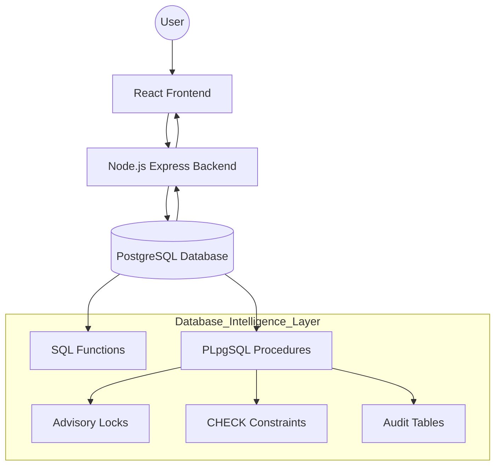

# 🌍 Smart Tourism Recommendation & Booking Platform

> **A database-centric smart tourism platform designed to deliver budget-aware travel recommendations, secure bookings, and integrity-enforced review management using advanced PostgreSQL database programming integrated with a modern full-stack web application.**

---

## 📖 Table of Contents
1. [📌 Project Overview](#-project-overview)
2. [🧠 Key Design Philosophy](#-key-design-philosophy)
3. [🏗️ System Architecture](#️-system-architecture)
4. [🛠️ Tech Stack](#️-tech-stack)
5. [🗄️ Database Design Highlights](#️-database-design-highlights)
6. [🔑 Core Database Features](#-core-database-features)
7. [🔄 Transaction Safety & Concurrency](#-transaction-safety--concurrency)
8. [🌐 API Design](#-api-design)
9. [🖥️ Frontend Features](#️-frontend-features)
10. [🧪 Error Handling & Validation](#-error-handling--validation)
11. [▶️ How to Run the Project](#️-how-to-run-the-project)
12. [📚 Academic Value (DBMS Focus)](#-academic-value-dbms-focus)
13. [🚀 Future Enhancements](#-future-enhancements)
14. [🏁 Conclusion](#-conclusion)

---

## 📌 Project Overview

The **Smart Tourism Recommendation & Booking Platform** is a **DBMS-first full-stack web application** that prioritizes **database-driven intelligence** over application-layer logic.

Unlike conventional systems where business rules are enforced mainly in backend code, this platform embeds core logic directly into PostgreSQL using:

- SQL Functions  
- PL/pgSQL Stored Procedures  
- CHECK Constraints  
- Transactions  
- Advisory Locks  
- JSONB Processing  

### 🎯 What the System Enables

Users can:

- Discover cities, hotels, food places, attractions, and transport.
- Receive budget-aware and rating-based recommendations.
- Book hotels and transport with automatic cost computation.
- Submit and manage reviews in a constraint-safe, validated system.

---

## 🧠 Key Design Philosophy

> **“Let the database do the heavy lifting.”**

This project follows a **Thick Database / Thin Application** architecture.

### Core Principles

- 💡 Business rules live in PostgreSQL  
- 🧹 Application layer remains thin and clean  
- 🔐 Data integrity is guaranteed  
- 🔄 All critical operations are transaction-safe  
- ⚙️ Concurrency is handled at the database level  

Even under concurrent requests, the database remains the **single source of truth**.

---

## 🏗️ System Architecture

The backend acts as a lightweight orchestration layer, while PostgreSQL serves as the core intelligence layer responsible for enforcing business rules and data integrity.



---

## 🛠️ Tech Stack

### Backend
- Node.js  
- Express.js  
- PostgreSQL  
- PL/pgSQL  

### Frontend
- React (Vite)  
- Tailwind CSS  
- Fetch API  

---

## 🗄️ Database Design Highlights

| Feature | Usage |
|----------|--------|
| SQL Functions | Fetch recommendations & compute totals |
| PL/pgSQL Procedures | Handle transactional workflows |
| CHECK Constraints | Enforce valid entity types |
| Advisory Locks | Prevent race conditions |
| Audit Logging | Track booking changes |
| JSONB Processing | Efficient batch review insertion |

---

## 🔑 Core Database Features

### 🏨 Hotel & Recommendation Functions
- Fetch hotels by city  
- Filter hotels based on user budget  
- Rank hotels by rating and price  
- Retrieve top attractions and food places  

### 💰 Budget-Aware Booking System
- Automatic total cost computation  
- Budget validation before booking  
- Atomic booking creation  
- Optional wallet deduction  
- Booking cancellation with refund  

### ⭐ Review Management System
- Reviews for Hotels, Food Places, Attractions, Transport  
- Strict entity validation via CHECK constraints  
- Batch review insertion using JSONB  
- User-specific review tracking  
- Entity-specific review retrieval  

---

## 🔄 Transaction Safety & Concurrency

All booking and review operations run inside transactions.

### Guarantees
- No partial writes  
- Automatic rollback on failure  
- Budget integrity preserved  

### Concurrency Control
```
pg_advisory_xact_lock(user_id)
```

Prevents race conditions during bookings and budget updates.

---

## 🌐 API Design

### Booking APIs
- POST /api/book  
- POST /api/cancel  
- GET /api/bookings/last  
- GET /api/bookings/history  

### Review APIs
- POST /api/reviews/batch  
- GET /api/reviews/:entity  
- GET /api/reviews/user  
- PUT /api/reviews  
- DELETE /api/reviews/:id  

All APIs directly call PostgreSQL procedures and functions.

---

## 🖥️ Frontend Features

- Responsive UI using Tailwind  
- City-wise browsing  
- Listings for hotels, food, attractions  
- Rating and review interface  
- User dashboard for bookings & reviews  
- Real-time validation feedback  

---

## 🧪 Error Handling & Validation

- Invalid bookings rejected at DB level  
- Invalid review entity types blocked by CHECK constraints  
- Meaningful errors returned to frontend  
- No silent failures  

---

## ▶️ How to Run the Project

### Backend
```bash
cd backend
npm install
nodemon server.js
```

Create `.env` inside backend:
```
DB_USER=postgres
DB_PASSWORD=yourpassword
DB_HOST=localhost
DB_PORT=5432
DB_NAME=tourism_db
```

Runs on: http://localhost:5000

---

### Frontend
```bash
cd frontend/my-tourism-project
npm install
npm run dev
```

Runs on: http://localhost:5173

---

## 📚 Academic Value (DBMS Focus)

This project demonstrates:

- Stored Procedures  
- Transaction Handling (ACID)  
- Constraint-driven schema design  
- JSONB processing  
- Database-level enforcement of business logic  
- Clean separation between DB and application layers  

---

## 🚀 Future Enhancements

- Personalized recommendation engine  
- Review sentiment analysis  
- Role-based access control  
- Tourism analytics dashboard  
- Mobile-friendly UI  

---

## 🏁 Conclusion

This project showcases how advanced database concepts can be applied to build a robust, scalable, and production-grade system.

By placing core logic inside PostgreSQL, the system achieves:

- High Integrity  
- Strong Consistency  
- Reliable Concurrency Handling  

A true DBMS-driven architecture.
